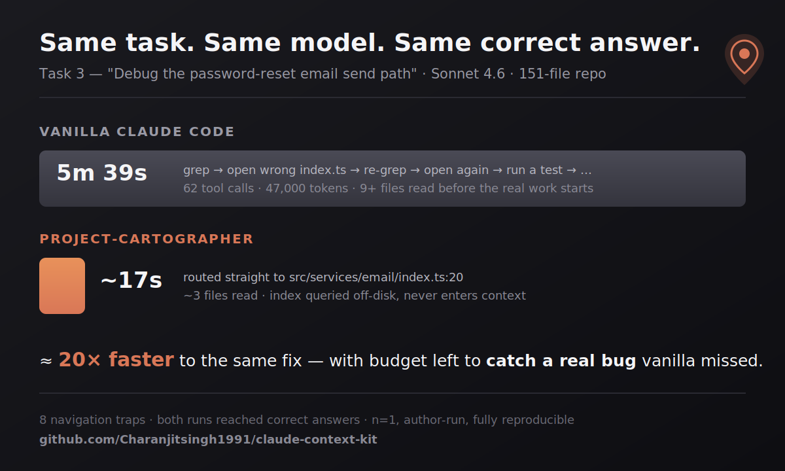
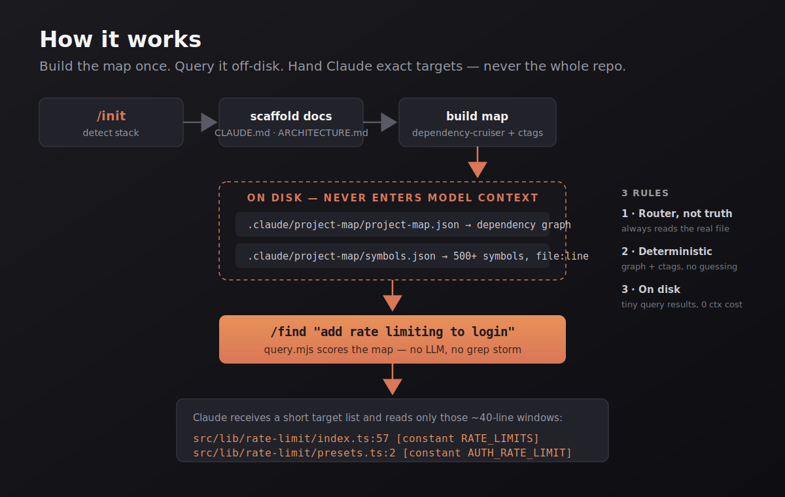

<div align="center">

# 🗺️ Project-Cartographer

### Stop letting Claude Code rediscover your codebase on every task.

**A token-cheap, safety-first navigation layer for Claude Code.** It builds a dependency graph and a symbol index of your repo *once*, then routes every task straight to the exact `file:line` — instead of burning thousands of tokens grepping and guessing.

[](https://docs.claude.com/en/docs/claude-code)
[](LICENSE)
[](https://nodejs.org)


[Install](#-install-30-seconds) · [Benchmark](#-the-benchmark) · [How it works](#-how-it-works) · [Commands](#-commands) · [Reproduce it yourself](BENCHMARK.md)

</div>

---

## The problem

On a large codebase, Claude Code spends most of its budget just *finding* the right file. It greps, opens the wrong `index.ts`, greps again, opens another, runs a test to orient itself — and only then starts the actual work. On one task in our benchmark, that exploration cost **62 tool calls, 47,000 tokens, and 5 minutes 39 seconds** — before a single line was changed.

The map of your codebase doesn't change between tasks. So why rebuild it from scratch every time?

## The fix

`project-cartographer` builds the map **once** and keeps it on disk. A small deterministic script queries that map and hands Claude a short list of exact targets:

```
❯ /project-cartographer:find "add stricter rate limiting to login"

  Targets (narrowed via symbol index — read ~40 lines around each):
    - src/lib/rate-limit/index.ts:57   [constant RATE_LIMITS]
    - src/lib/rate-limit/presets.ts:2  [constant AUTH_RATE_LIMIT]
```

No grep storm. No wrong-file detours. The index lives on disk and is queried by scripts, so **it never enters the model's context** — that's where the token savings come from.

---

## 📊 The benchmark

<div align="center">



</div>

We built a **151-file production-grade SaaS codebase** (Next.js 15, Prisma, NextAuth 5, Stripe, Redis/BullMQ) and planted **8 navigation traps** — the kind of misdirection real codebases are full of: three different `formatCurrency` functions, four files named `index.ts` in the email path, a deprecated `getSession` sitting next to the real one.

Then we ran the same 8 tasks twice with the same model (Claude Sonnet 4.6): once with vanilla Claude Code, once with project-cartographer.

> **Every task, both setups reached a correct answer.** The difference is what it *cost* to get there — and what was found along the way.

| # | Task | Vanilla | project-cartographer |
|---|------|---------|----------------------|
| 1 | Session + subscription redirect | 3 files explored | ✅ first hit · `session/index.ts:15` · flagged 2 decoy fns |
| 2 | Invoice currency formatter | 4 files, 2 search rounds | ✅ first hit · mapped all 3 variants |
| 3 | Password-reset email path | **62 tool calls · 47k tokens · 5m39s** | ✅ **~17s** · found an unused-template bug |
| 4 | Login rate limit | 5 files, 3 glob searches | ✅ first hit · flagged a config-drift risk |
| 5 | Stale feature-flag cache | 4 files | ✅ first hit · found a DB/redis inconsistency |
| 6 | Stripe cancel → plan revert | 3 files | ✅ first hit · found a webhook/worker race |
| 7 | Audit log on member removal | 7 files | ✅ first hit · explained a silent-fail by design |
| 8 | Welcome-email job pipeline | 5 files, 2 rounds | ✅ first hit · found 3 distinct bugs |

**The headline:** on the worst case (Task 3), the same correct result went from **5m39s of exploration to ~17 seconds of direct routing.** And because Cartographer wasn't spending its budget hunting for files, it had room left to *reason* — surfacing real bugs (wrong queue names, cache inconsistencies, race conditions) that the vanilla run walked right past.

> ⚠️ **Honest caveat:** this is a single run, on one model, authored by the plugin's creator. We're not claiming a peer-reviewed study — we're handing you the **exact repo, the 8 traps, and the raw transcripts** so you can run it yourself. Full methodology + reproduction steps: **[BENCHMARK.md](BENCHMARK.md)**.

---

## 🚀 Install (30 seconds)

```bash
# In Claude Code:
/plugin marketplace add https://github.com/Charanjitsingh1991/claude-context-kit.git
/plugin install project-cartographer@claude-context-kit
/reload-plugins
```

Then, in any project:

```bash
/project-cartographer:init
```

That's it. `init` detects your stack, scaffolds context docs, and builds the map.

**Optional but recommended** — install [universal-ctags](https://github.com/universal-ctags/ctags) for symbol-level (`file:line`) precision. Without it, routing falls back to the dependency graph (file-level, still useful).

| OS | Command |
|----|---------|
| macOS | `brew install universal-ctags` |
| Linux | `apt-get install universal-ctags` |
| Windows | `choco install universal-ctags` |

---

## 🧠 How it works

<div align="center">



</div>

<details>
<summary>Text version</summary>

```
┌─────────────────────────────────────────────────────────────┐
│  /init  ──▶  detect stack  ──▶  scaffold docs  ──▶  build map │
└─────────────────────────────────────────────────────────────┘
                                                       │
                        ┌──────────────────────────────┘
                        ▼
     ON DISK (never enters model context):
       .claude/project-map/project-map.json   ← dependency graph
       .claude/project-map/symbols.json       ← 500+ symbols, file:line
                        │
                        ▼
     /find "task"  ──▶  query.mjs scores the map  ──▶  returns a
                        short list of exact targets  ──▶  Claude reads
                        only those ~40-line windows
```

</details>

Three design rules the whole plugin follows:

1. **The map is a router, not a source of truth.** Claude always reads the *real* file before editing. The map just says *where to look*.
2. **Deterministic over narrated.** The graph comes from [`dependency-cruiser`](https://github.com/sverweij/dependency-cruiser), symbols from [`universal-ctags`](https://github.com/universal-ctags/ctags), API checks from your installed `.d.ts` files. No hallucinated structure.
3. **Indexes stay on disk.** Scripts query them; results are tiny. The 500-symbol index never costs you context tokens.

---

## 🧰 Commands

| Command | What it does |
|---------|--------------|
| `/project-cartographer:init` | Detect stack → recommend docs → scaffold → build map |
| `/project-cartographer:find "<task>"` | **The core loop.** Route a task to exact `file:line` targets |
| `/project-cartographer:impact <symbol>` | Blast radius — what breaks if you change this |
| `/project-cartographer:verify` | Scoped type-check + lint + related tests on *changed* files only |
| `/project-cartographer:api <pkg>` | Confirm an API exists in the *installed* version (anti-hallucination) |
| `/project-cartographer:checkpoint` | Non-destructive recovery point before a risky change |
| `/project-cartographer:map` | Rebuild graph + symbols + human-readable `nodes.md` |
| `/project-cartographer:check` | Is the map stale vs. git HEAD? |
| `/project-cartographer:plan` | Lock a goal + acceptance criteria (anti-drift on long tasks) |
| `/project-cartographer:log "<note>"` | Append to a cross-session decision log |

Plus a **safety hook**: a `PreToolUse` guard that blocks destructive commands (`rm -rf`, force-push, DB resets) and catches secrets/`.env` content before they land in an edit.

---

## 🤔 Why not just use a bigger context window / grep / an MCP server?

- **Bigger context** doesn't help — re-reading the repo every task is the *cost*, not the cure. Cartographer's win is *not* loading the repo into context at all.
- **Plain grep** is what vanilla already does; the benchmark *is* grep-and-guess. The win is a ranked, structured index over a flat text search.
- **An MCP server** is a fine alternative architecture, but it adds a running process and round-trips. Cartographer is just files + small scripts — nothing to host, nothing to keep alive.

---

## 📦 Requirements

- **Node 18+**
- **`dependency-cruiser`** (pulled via `npx` — JS/TS/Vue dependency edges)
- **`universal-ctags`** *(optional)* — symbol index across 150+ languages

---

## 🗂️ Repo structure

```
claude-context-kit/            ← repo root = plugin root
├── .claude-plugin/
│   ├── marketplace.json       ← marketplace catalog
│   └── plugin.json            ← plugin manifest
├── commands/                  ← 11 slash commands
├── hooks/                     ← PreToolUse guard + SessionStart digest
├── scripts/                   ← 14 deterministic Node scripts
├── skills/                    ← 8 auto-triggering skills
├── BENCHMARK.md               ← full methodology + reproduction
└── README.md
```

---

## 🤝 Contributing

Issues and PRs welcome — especially:
- New language support for dependency edges (currently JS/TS/Vue)
- Additional benchmark traps / other stacks
- Windows path-handling edge cases

If you run the benchmark on your own repo, **open an issue with your numbers** — good or bad. Real-world data makes this better.

---

## 📄 License

MIT © [Charanjit Singh](https://github.com/Charanjitsingh1991)

<div align="center">
<sub>If this saved you tokens, a ⭐ helps other people find it.</sub>
</div>
